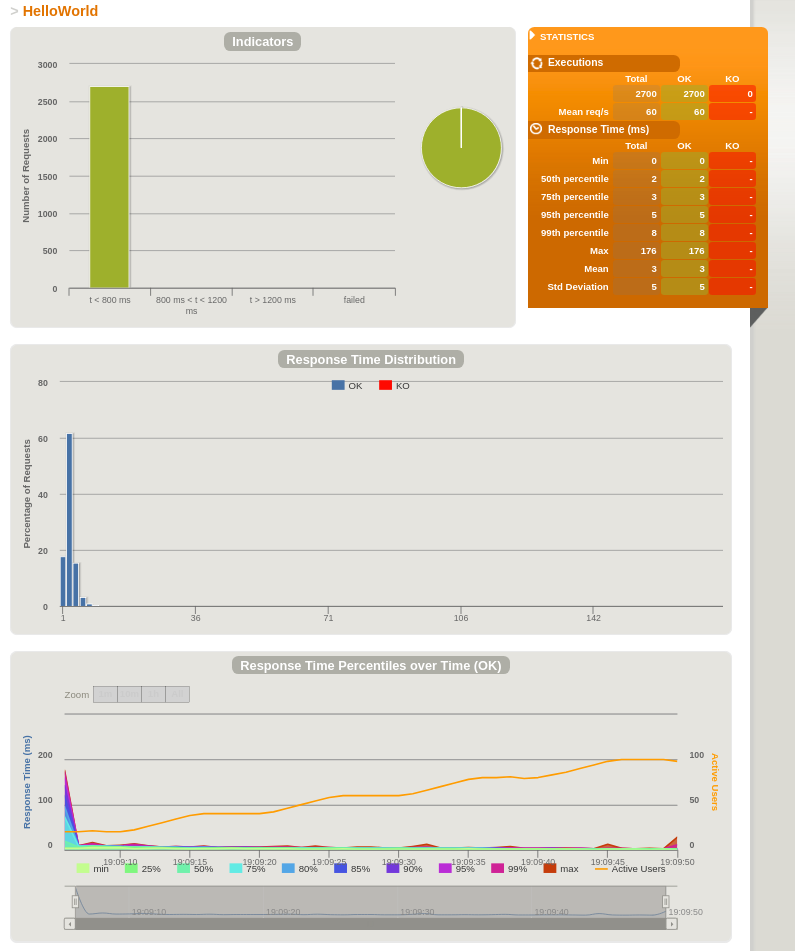

Just before Christmas, just after the rest of the team had left for their holidays, I discovered a weird performance problem with a Spring Boot application we'd just started writing.
This is a the story of how I found the problem and the detective work that led me to the culprit - one you may yourself face.
We're going to recreate the app and the performance tests, but first I'll tell you how we got here.

## Prologue

20/sec.
Twenty requests per second.
Any more than that and response times would climb.
Eventually, the load balancer's readiness checks would timeout and it'd refuse to send traffic to the app, taking the service offline.

The app is very simple.
Each request is a query. The app makes a few queries to a graph database and return an answer.
It's running in a Kubernetes cluster on AWS, behind an Elastic Load Balancer.
How can it be struggling to serve more than twenty requests per second?

My first thoughts - I've not used this graph database before, can it really be that slow? Nor have I used Kubernetes or Spring Boot, surely they can't be the problem?

There's a lot of potential culprits here, so let's eliminate some. Can I reproduce the problem here on my machine? Yes - and I get a clue. As the test runs, I can hear the fan spinning up. Checking back on AWS for server metrics, the CPU utilisation was shooting up to 100% during the test. That removes Kubernetes, the load balancer, the network and disks from the investigation, at least for now. Memory could still be a problem, as Java's garbage collection chews up compute time when there's not enough memory.

The next thing to do is to eliminate the database. We'd written a resource to return version information, which is just returning a document from memory. Running the performance test on that endpoint revealed the same terrible performance! Something to do with Spring then - where can we go from here?

Back to basics. Eliminate all of our code. How does a "getting started" Spring Boot app that's configured similarly to our real app perform?

This is where we join the story.

## The "Getting Started" App

I based the "getting started" app closely on [Spring Boot's documentation](https://spring.io/guides/gs/spring-boot/). It's got one endpoint at `/` and returns the string "Hello from Spring Boot".

## Performance Testing with Gatling

[Gatling](https://gatling.io/) is the tooling that gave me those requests per second figures, so we'll use it to do our performance tests. Gatling tests are written in Scala and can coexist with the Java code, but we need a little support in our project to run tests and get editor support for Scala.

To compile Scala code, and enable Scala support (at least in IntelliJ IDEA) I used the rather neat [scala-maven-plugin](https://davidb.github.io/scala-maven-plugin/index.html):

```xml
<plugin>
    <groupId>net.alchim31.maven</groupId>
    <artifactId>scala-maven-plugin</artifactId>
    <version>3.4.4</version>
    <executions>
        <execution>
            <id>scala-test-compile</id>
            <phase>process-test-resources</phase>
            <goals>
                <goal>testCompile</goal>
            </goals>
        </execution>
    </executions>
</plugin>
```

To run Gatling from Maven and view its output, we need a dependency and a plugin:

```xml
<dependency>
    <groupId>io.gatling.highcharts</groupId>
    <artifactId>gatling-charts-highcharts</artifactId>
    <scope>test</scope>
    <version>3.0.2</version>
</dependency>
```

```xml
<plugin>
    <groupId>io.gatling</groupId>
    <artifactId>gatling-maven-plugin</artifactId>
    <version>3.0.1</version>
</plugin>
```

Now we can write a Gatling test. This is our scenario, describing the client behaviour we want to test.

```scala
setUp(myScenario.inject(
    incrementUsersPerSec(20)
      .times(5)
      .eachLevelLasting(5 seconds)
      .startingFrom(20)
  )).protocols(httpProtocol)
    .assertions(global.successfulRequests.percent.is(100))
```

We're starting with 20 users per second making a request to the `/` resource, holding at that concurrency for five seconds. Then we increase the number of users per second by twenty, five times, holding for five seconds each time. Simple!

You'll find the code we've talked about so far on Github at https://github.com/brabster/performance-with-spring-boot/tree/1.0. 

Let's start the webapp and run the tests. You'll see `mvn spring-boot:run` starting the webapp up, then being pushed to the background, then `mvn gatling:test` running the tests.


When the tests run you see a progress bar being refreshed every few seconds. The `###` part represents the proportion of requests that have been made and completed. If there were any requests made but not yet completed, you'd see dashes at the end like this `###---`. Our app is running fast enough that there aren't any requests outstanding when Gatling samples to draw any of the updates. That's good!

If you cloned the project, try changing the scenario in [LoadTest.scala](https://github.com/brabster/performance-with-spring-boot/blob/1.0/src/test/scala/hello/LoadTest.scala). How many requests per second can your system sustain?

## Gatling's Reports

Gatling saves a report for each test. For the test we just ran, our report looks like this.



That's pretty healthy. All the requests were served up quickly, with the 99th percentile at 8ms (that is, 99% of requests were completed in 8ms or less).

## Next Time

That's the context, the tools and a simple codebase to get us started. Next time, we'll see how a performance problem shows itself and figure out how to resolve it.