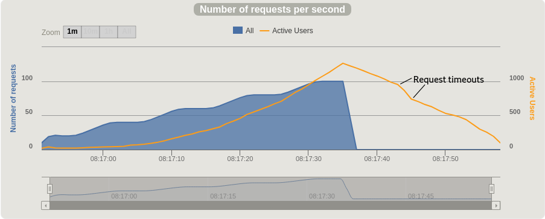
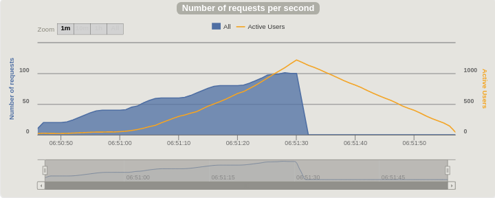
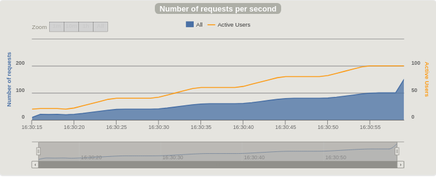

In [part 1](/posts/spring-boot-performance-part-1), we built a simple Spring Boot webapp and demonstrated a surprising performance problem.
A Gatling performance test simulating different numbers of users making a single request showed our webapp unable to keep up with 40 "users" making one request per second on my fairly powerful computer.

We've already eliminate many problems, so we can use a process of elimination to figure out what's causing the problem. Let's start with a classic.

## How Many Threads?

Spring Boot apps run in an embedded Tomcat server by default, and the most obvious place for us to look is Tomcat's thread pool.
I think that's habit and bias on my part, because the evidence we've seen doesn't really support a thread configuration problem.
If we were, say, talking to a slow database synchronously then it would seem more likely that we might be running out of threads to service new requests as exising requests keep threads waiting for responses from the database.

As it's easy, we'll see what happens if we increase the number of threads Tomcat can use. We can check the [documentation](https://docs.spring.io/spring-boot/docs/current/reference/html/common-application-properties.html) to see that the default thread pool size is 200 threads and how to increase it.
We can increase that by an order of magnitude to 2000 threads in `application.properties`:

`server.tomcat.max-threads=2000`

Running our Gatling test shows that this change has adversely affected performance. We see more active users at peak and a funny dip in the actives line as the backlog is cleared. That dip, marked on the chart below, is a few requests timing out.



That didn't help, so let's put the max thread count back to the default before we try anything else! If you're following along, I recommend using `clean`, as in `mvn clean spring-boot:run` to ensure that nothing is remembered from the previous build. You can lose a lot of time acting on misleading results otherwise!

## JSON Encoding

Another unlikely candidate is the JSON encoding we're doing on our responses. Out of the box, Spring Boot uses the venerable [Jackson](https://github.com/FasterXML/jackson) library, but you never know, the default settings might be really ineffcient. Again, it's really easy to check so let's find out. We update the controller so that instead of returning Java object containing a String, it returns just a plain string, so from:


```java
    class Greeting {
        public String getGreeting() {
            return "Greetings from Spring Boot!";
        }
    }

    @RequestMapping("/")
    public Greeting index() {
        return new Greeting();
    }
```
to:

```java
    @RequestMapping("/")
    public String index() {
        return "Greetings from Spring Boot!";
    }
```

If you make that change and run the Gatling test, you see...

*...drum roll...*

No detectable difference from the original results we got in part 1. Not really a surprise, JSON encoding isn't the problem.

## Spring Security

The next thing we can check easily is whether Spring Security is causing the problem somehow. Like the cases above, we've got well tried and tested software running with Spring Boot's sensible defaults, so it yet again seems unlikely. Something's causing the poor performance and Spring Security does lots of things though, like authentication and session management. We're running out of possible causes though so let's give it a try.

The quick and easy way to check whether something that Spring Security is autoconfiguring in is causing the problem is to just omit the dependency. Let's delete `spring-security-web` and `spring-security-config` from our `pom.xml`. We can see there's less happening on startup, but will it handle the load better? Let's run the test.


We have a winner! You can see that the performance is improved. No active requests throughout the test - the app is keeping up easily. The charts tell the same story. Let's compare side by side to get a feel for the difference.

### Response time distribution, before:


### Response time distribution, after:


Instead of a spread of response times all the way up to 30 seconds, we have all responses served within a few milliseconds. Much better! On to requests per second.

### Requests per Second and Active Users, before:



### Requests per Second and Active Users, after:


To appreciate the difference, note the different scale for Active Users, the y-axis on the right, and the total time the test ran for on the x-axis. Before, the number of active users climbed faster than the request rate, indicating that requests would start timing out if the test hadn't ended. After we remove Spring Security, the number of active users is the same as the request rate throughout the test, so the app is keeping up perfectly with the load.

## What's causing the problem?

Spring Security with Spring Boot [automatically applies sensible security settings to an app when it's on the classpath](https://docs.spring.io/spring-boot/docs/current/reference/html/boot-features-security.html). You take control of aspects of configuration through annotations and extending classes. As this is such a simple app, there's not too much to check. We'll take control of authentication and roughly replicate the automatic configuration with this `@Configuration` annotated class

```java
@Configuration
public class SecurityConfig extends WebSecurityConfigurerAdapter {

    @Override
    public void configure(HttpSecurity http) throws Exception {
        http.httpBasic();
    }

}
```

The Gatling test shows that the performance problem is back. Delete the `http.httpBasic()` line and the problem goes away. Something to do with authentication then. I didn't find anything in Spring Security or Spring Boot documentation to explain it.

I'm not sure how you'd figure it out if you didn't know where to start. GIven a little experience with passwords and authentication you can join the remaining dots. There's two things going on, the first is password encoding.

### Password Encoding

We protect passwords for by 'encoding' or 'hashing' them before we store them. When the user authenticates, we encode the password they gave us and compare with our stored hash to see if the password was right.

The choice of encoding algorithm is important in this world of cloud computing, GPUs and hardware acceleration. We need an algoriithm that needs a lot of CPU power to encode. We get a password encoder using the "Bcrypt" algorithm by default, an algorithm that's been designed to withstand modern techniques and compute power. You can read more about Bcrypt and how it helps keep your user database secure in [Auth0's article](https://auth0.com/blog/hashing-in-action-understanding-bcrypt) and Jeff Attwood's post on [Coding Horror](https://blog.codinghorror.com/speed-hashing/).

See the connection yet? The choice of Bcrypt makes sense for protecting the credentials we're entrusted with, but do we do about this terrible performance?

### Sessions

By default, the security config responds to our first authentication with a cookie containing a session ID. That is exchanged without any encoding. Sessions come with lots of problems of their own, so we'll leave that one for another day. If we'd been using a browser, or Gatling had been set up to make lots of requests as the same user, we'd have used the session ID and not seen a performance problem.

## Reconfiguring our App

We'll override the password encoder to prove that it is causing the performance problem. As we're dealing with a test password, we don't need to worry about it not being secured. We update our `SecurityConfig` class like this:

```java
@Configuration
public class SecurityConfig extends WebSecurityConfigurerAdapter {

    // make the credentials in application.properties available
    @Value("${spring.security.user.name}")
    private String username;

    @Value("${spring.security.user.password}")
    private String password;

    @Override
    protected void configure(AuthenticationManagerBuilder auth) throws Exception {

        System.out.println(username);
        System.out.println(password);

        // choose a more efficient (and far weaked) hashing algorithm
        final PasswordEncoder sha256 = new StandardPasswordEncoder();

        auth.inMemoryAuthentication()
                .passwordEncoder(sha256)
                .withUser(username)
                .password(sha256.encode(password))
                .roles("USER");
    }

    @Override
    public void configure(HttpSecurity http) throws Exception {
        http.httpBasic();
    }

}
```
When we run our performance test one last time, we see that we have performance and we have authentication.

How fast can it go? WHen I push the request rate higher, I see that this app can actually handle around 2,000 requests per second. I won't bore you with more asciinema or the charts, but you can [play with the updated app yourself](https://github.com/brabster/performance-with-spring-boot/tree/2.0) if you want. 

## The Future

We can't leave the password encoder set to something insecure. It's not clear at this point in the project how authentcation will need to work so we're fine using this setup with our prototype, hard-coded password and test data. Performance will be an important part of figuring out what authentication solution to use!


